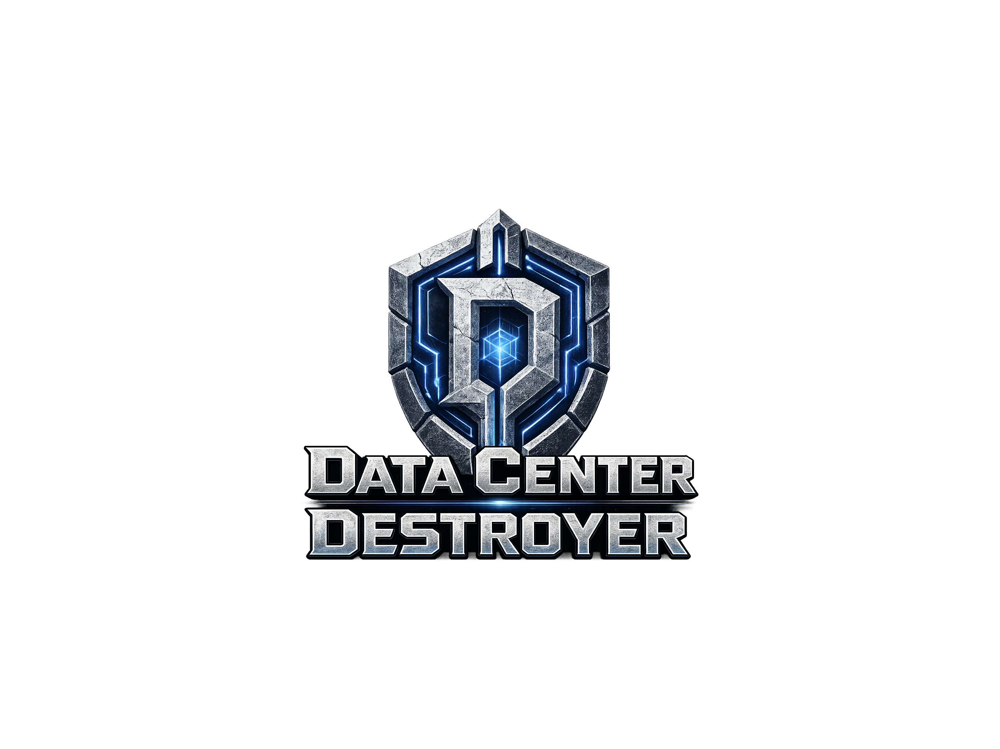

# Data Center Destroyer

A real-time, voice-controlled tower defense game with PvP multiplayer. Defend your data center against waves of enemies while attacking your opponent's — all hands-free with voice commands powered by OpenAI Whisper.



---

## Features

- **Voice control** — speak commands to build towers, move your hero, scroll the map, and deploy attacks
- **Single-player** — survive 15 waves against an AI opponent that builds and attacks autonomously
- **Multiplayer (PvP)** — real-time 1v1 matches via Convex with deterministic lockstep simulation
- **5 tower types** — each with unique mechanics and 3 upgrade levels
- **5 attack packages** — spend offense resources to pressure your opponent's base
- **Hero unit** — a mobile fighter you can reposition by voice or click

---

## Tech Stack

| Layer | Technology |
|---|---|
| Frontend | React 18 + TypeScript |
| Build | Vite 6 |
| Styling | Tailwind CSS |
| Game engine | Custom canvas renderer + deterministic tick engine |
| Multiplayer backend | [Convex](https://convex.dev) (real-time sync, rooms, lockstep actions) |
| Voice / STT | OpenAI Whisper (`gpt-4o-transcribe`) + GPT-4o-mini autocorrect |
| RNG | Seeded deterministic random (seedrandom) |
| Deployment | Vercel |

---

## Getting Started

### Prerequisites

- Node.js 18+
- An [OpenAI API key](https://platform.openai.com/api-keys) (for voice commands)
- A [Convex](https://dashboard.convex.dev) project (for multiplayer)

### 1. Clone and install

```bash
git clone https://github.com/sayyidkhan/data-center-destroyer.git
cd data-center-destroyer
npm install
```

### 2. Set up environment variables

```bash
cp .env.example .env
```

Then fill in your `.env`:

```env
# Convex backend
VITE_CONVEX_URL=https://<your-deployment>.convex.cloud
VITE_CONVEX_SITE_URL=https://<your-deployment>.convex.site

# Multiplayer settings
VITE_COUNTDOWN_SECONDS=3
VITE_MAX_PLAYERS_PER_ROOM=4
VITE_ROOM_CODE_LENGTH=6

# OpenAI Speech-to-Text (exposes key to browser — hackathon/demo use only)
VITE_OPENAI_API_KEY=sk-...
```

### 3. Start Convex (multiplayer backend)

```bash
npx convex dev
```

### 4. Run the dev server

```bash
npm run dev
```

Open [http://localhost:5173](http://localhost:5173).

---

## Gameplay

### Objective

Destroy the opponent's data center before they destroy yours. You have **20 lives** — each enemy that leaks through your defenses costs one.

### Map

The map is a **66 × 14 cell** grid. Enemies follow a fixed winding path from one side to the other. You build towers on your side of the map; your opponent (AI or human) builds on theirs.

### Towers

Build towers with gold earned from killing enemies. Towers can be upgraded up to **3 levels** and sold for 60% refund.

| Tower | Cost | Mechanic |
|---|---|---|
| **Cannon** | 75g | Splash damage; higher levels debuff and armor-break |
| **Laser** | 120g | Continuous beam; burns for sustained DPS |
| **Frost** | 100g | Slows and freezes enemies |
| **Tesla** | 150g | Chains lightning to nearby enemies |
| **Missile** | 200g | Long range; high single-target burst |

### Hero

Your hero is a mobile combat unit that follows the path and attacks enemies. Move it to intercept dangerous leaks or to apply pressure. It respawns automatically if killed.

### Attack Packages (PvP)

Spend **Offense Resource** (passively generated, max 250) to send enemies directly at your opponent's base.

| Package | Cost | Description |
|---|---|---|
| **Grunt Pack** | 25 | Cheap pressure; basic foot soldiers |
| **Speeder Rush** | 45 | Fast units; low durability |
| **Swarm Burst** | 60 | Many weak units; overloads tower targeting |
| **Tank Push** | 70 | Armored; forces defensive tower upgrades |
| **Boss Signal** | 140 | Single massive unit; chunks base HP |

### Waves

There are **15 waves** in a match. Enemy HP scales **+12% per wave**. Start each wave manually or let the timer auto-start it.

---

## Voice Commands

Voice commands require your `VITE_OPENAI_API_KEY` to be set. Press the microphone button to activate, then speak naturally.

### Building

| Say | Action |
|---|---|
| `put laser on S 12` | Build laser at column S, row 12 |
| `build cannon at D 6` | Build cannon at D6 |
| `place frost H 3` | Build frost tower at H3 |
| `set tesla G 4` | Build tesla at G4 |
| `add missile C 9` | Build missile at C9 |

### Upgrading

| Say | Action |
|---|---|
| `upgrade S 7` | Upgrade tower at S7 |
| `level up laser at D 6` | Upgrade tower at D6 |
| `S 7 level up` | Upgrade tower at S7 |

### Hero

| Say | Action |
|---|---|
| `hero move to H 5` | Move hero to H5 |
| `hero up / down / left / right` | Nudge hero one cell |

### Camera

| Say | Action |
|---|---|
| `scroll right / left` | Pan camera |
| `scroll right x 5` | Pan 5 steps |
| `scroll to start / end` | Jump to map edge |

### Attack Packages

| Say | Action |
|---|---|
| `deploy grunt pack` | Send grunt pack |
| `deploy speeder rush` | Send speeder rush |
| `deploy tank push` | Send tank push |
| `deploy swarm burst` | Send swarm burst |
| `deploy boss signal` | Send boss signal |

### Other

| Say | Action |
|---|---|
| `start wave` | Begin the next wave |
| `pause` | Toggle pause |
| `cancel` | Deselect / cancel |
| `ops scroll down` | Scroll attack ops panel |

---

## Deployment (Vercel)

1. Push to GitHub
2. Import the repo in [Vercel](https://vercel.com)
3. Add the following **Environment Variables** in Vercel project settings:

| Variable | Value |
|---|---|
| `VITE_CONVEX_URL` | Your Convex deployment URL |
| `VITE_CONVEX_SITE_URL` | Your Convex site URL |
| `VITE_COUNTDOWN_SECONDS` | `3` |
| `VITE_MAX_PLAYERS_PER_ROOM` | `4` |
| `VITE_ROOM_CODE_LENGTH` | `6` |
| `VITE_OPENAI_API_KEY` | Your OpenAI API key |

4. Deploy — Vercel auto-runs `npm run build` which includes game data generation.

> **Note:** `CONVEX_DEPLOYMENT` is only needed locally for `npx convex dev`. Do not add it to Vercel.

---

## Project Structure

```
data-center-destroyer/
├── convex/              # Convex backend (rooms, schema, real-time sync)
├── public/              # Static assets (logos)
├── scripts/             # Game data generation script
├── src/
│   ├── components/      # React UI components (HUD, overlays, shop, lobby)
│   ├── data/            # Game balance JSON files (towers, enemies, waves...)
│   ├── game/            # Core engine (engine.ts, renderer.ts, pathfinding, types)
│   └── hooks/           # useVoiceController, useGameLoop
├── .env.example
└── vite.config.ts
```

---

## License

MIT
